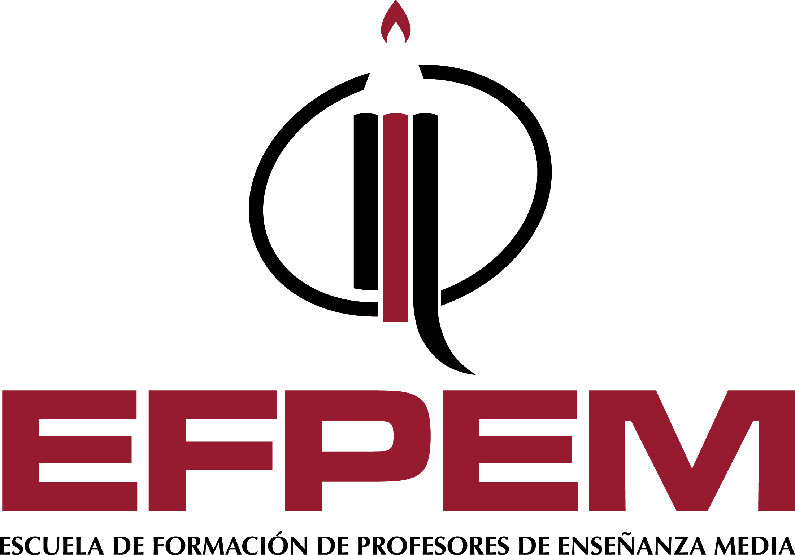

Universidad de San Carlos de Guatemala – USAC 
Escuela de Formación de Profesores de Enseñanza Media - EFPEM 
Cátedra de Computación e Informática - CCI 
Licenciatura en la Enseñanza de la Informática y Computación 
Curso: Didáctica de la programación 

<h3 align=center>PRACTICA BÁSICA DE PHP, GIT y GITHUB</h3>
<b>Carné:</b> 201401037 
<b>Nombrer:</b> Diego Josué Moises Yoc Chajón 

<b>Ejemplos</b> 

<table border=1>
	<tr>
		<td>No.</td>
		<td>Descripción</td>
		<td>Enlace</td>
	</tr>
	<tr>
		<td>1.</td>
		<td>Promedio de 4 números</td>
		<td><a href="PHP/Ejemplo1.php">Clic para ver ejemplo</a></td>
	</tr>
	<tr>
		<td>2.</td>
		<td>Área de un trapecio</td>
		<td><a href="PHP/Ejemplo2.php">Clic para ver ejemplo</a></td>
	</tr>
	<tr>
		<td>3.</td>
		<td>Mayor, menor y medio de tres números</td>
		<td><a href="PHP/Ejemplo3.php">Clic para ver ejemplo</a></td>
	</tr>
	<tr>
		<td>4.</td>
		<td>Indicar cual vocal es la que se repite más veces en un texto.</td>
		<td><a href="PHP/Ejemplo4.php">Clic para ver ejemplo</a></td>
	</tr>
	<tr>
		<td>5.</td>
		<td>Convertir de binario a Decimal</td>
		<td><a href="PHP/Ejemplo5.php">Clic para ver ejemplo</a></td>
	</tr>
	<tr>
		<td>6.</td>
		<td>Ordenar de forma ascendente y descendente 20 valores numéricos almacenados en un array.</td>
		<td><a href="PHP/Ejemplo6.php">Clic para ver ejemplo</a></td>
	</tr>
</table>   
<h2 align=center>INTRODUCCIÓN A LA PROGRAMACION ORIENTADA A OBJETOS</h2>
<ol>
	<li>POO</li>
		<ul>
			<li>Clase</li>
			<li>Objeto</li>
			<li>¿Qué significa instanciar una clase?</li>
		</ul>
	<li>Los 4 pilares de la programación orientada a objetos:</li>
		<ul>
			<li>Encapsulamiento</li>
			<li>Abstracción</li>
			<li>Herencia</li>
			<li>Poliformismo</li>
		</ul>
</ol>

 

"Id y enseñad a todos"

